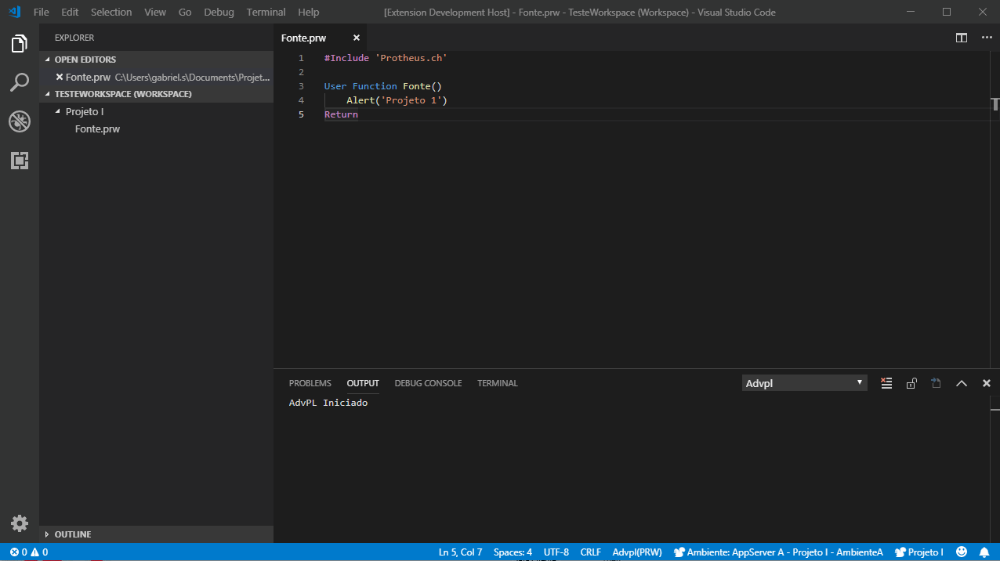

 [](https://travis-ci.com/AlencarGabriel/advpl-switch-project)  
# Troca de projeto AdvPL

Esta é a extensão que vai facilitar seus Debugs de projetos AdvPL com arquivos repetidos, e ainda a organizar melhor os projetos x ambientes.

>**Estou muito feliz pelo seu Download e espero que goste!**

## Necessidade
Assim como acontece com o tão querido TDS, quando há arquivos com o mesmo nome no Workspace, o Debug se "perde".

Porém no VSCode não há a opção: ***Fechar Projeto***. Esta extensão irá te ajudar a resolver este impasse em alguns minutos, basta fazer algumas configurações e pronto ;)

## Features

Esta extensão possui as seguintes funcionalidades implementadas:

* **[New]** Relacionar ambientes do AdvPL com o Projeto aberto
* **[New]** Habilitar/Desabilitar todos os ambientes AdvPL
* Trocar projeto ativo no Workspace
* Remover últimos projetos

Próximas implementações:

* [Alterar ambiente ativo quando trocar projeto.](https://github.com/AlencarGabriel/advpl-switch-project/issues/14)
* [Converter Workspace to Configuration.](https://github.com/AlencarGabriel/advpl-switch-project/issues/2)
* [Wizard para adicionar projetos.](https://github.com/AlencarGabriel/advpl-switch-project/issues/3)

## Looking For...
* **[pt-br]** Alguem que possa me ajudar com a tradução dessa extensão para Inglês, Espanhol ou Russo. Caso tenha interesse entre em [contato comigo](mailto:alencargabriel@outlook.com.br)
* **[en-us]** Someone who can help me with the translation of this extension to English, Spanish or Russian. If you are interested in [contact me](mailto:alencargabriel@outlook.com.br)
* **[es es]** Alguien que pueda ayudarme con la traducción de esta extensión a Inglés, Español o Ruso. Si tiene interés entre en [contacto conmigo](mailto:alencargabriel@outlook.com.br)
* **[ru ru]** Тот, кто может помочь мне с переводом этого расширения на английский, испанский или русский. Если вы заинтересованы в [свяжитесь со мной](mailto:alencargabriel@outlook.com.br)

## Requisitos para utilização

Esta extensão depende da [advpl-vscode](https://marketplace.visualstudio.com/items?itemName=KillerAll.advpl-vscode) desenvolvida por [Rodrigo Antonio Godinho da Silva](https://github.com/killerall).

## Configuração
Por padrão o VSCode adiciona no Workspace Settings as pastas do Workspace. Esta extensão manipula esta configuração conforme o projeto que está sendo usado.

> No fim deste arquivo há um exemplo de configuração.


## Utilização
A extensão é ativada sempre que um projeto AdvPL é aberto, ou o comando é chamado o comando `Trocar Projeto` manualmente.

> Esta extensão não reabre os arquivos que já estão abertos no editor.


## Relacionar Ambiente x Projeto
É possível relacionar os ambientes da configuração `advpl.environments` com os projetos configurados no workspace `advpl.foldersProject`. Assim é possível organizar melhor os ambientes que estarão disponíveis na lista.

> No fim deste arquivo há um exemplo de configuração.

> Este recurso só funcionará se a configuração `advpl.onlyRelatedEnvironments` estiver habilitada.

### Importante:

* Caso a configuração `advpl.environments` esteja nas **Configurações do Usuário**, deve ser transferido para as **Configurações do Workspace**;
* Após transferir as configurações reinicie o VSCode;
* Caso esteja usando o atributo **name** na configuração `advpl.environments`, deve estar no `advpl.foldersProject.environments[]` o nome dos ambientes, se não estiver usando **name** a extensão irá considerar o atributo **environment**.



## [Issues](https://github.com/AlencarGabriel/advpl-switch-project/issues)

Caso encontre algum problema, tenha alguma dúvida ou sugestão de melhoria, fique a vontade para abrir uma Issue ou enviar um Pull Request.

## Comandos da Extensão
* `Advpl - Trocar projeto ativo`
* `Advpl - Remover últimos projetos`
* `Advpl - Habilitar todos os Ambientes`
* `Advpl - Desabilitar todos os Ambientes`

## Configurações da Extensão

Esta extensão contribui com as seguintes configurações:

* **[New]** `advpl.onlyRelatedEnvironments: true;` // Mostrar somente os ambientes vinculados ao projeto
* `advpl.projectActive: "Projeto padrão do Workspace";`
* Pastas do projeto:

```
"advpl.foldersProject": [
    {
        "path": "Caminho da pasta do projeto",
        "name": "Alias para o projeto",
        "environments": [
            "Environment A",
            "Environment B"
        ] // Ambientes da configuração advpl.environments relacionados a este projeto
    }
]
```

<!-- ## Known Issues

Calling out known issues can help limit users opening duplicate issues against your extension. -->

---
<!--
## Working with Markdown

**Note:** You can author your README using Visual Studio Code.  Here are some useful editor keyboard shortcuts:

* Split the editor (`Cmd+\` on macOS or `Ctrl+\` on Windows and Linux)
* Toggle preview (`Shift+CMD+V` on macOS or `Shift+Ctrl+V` on Windows and Linux)
* Press `Ctrl+Space` (Windows, Linux) or `Cmd+Space` (macOS) to see a list of Markdown snippets

### For more information

* [Visual Studio Code's Markdown Support](http://code.visualstudio.com/docs/languages/markdown)
* [Markdown Syntax Reference](https://help.github.com/articles/markdown-basics/) -->

**Aproveite, me ajuda e com certeza irá te ajudar tambem!** :heart:
