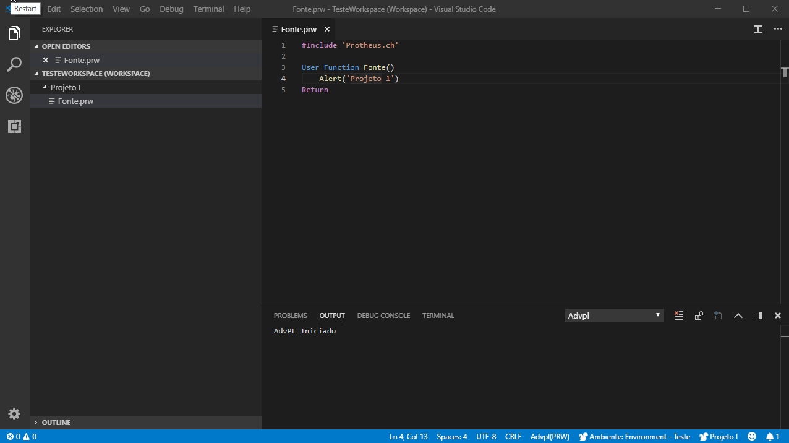

  
# Troca de projeto ADvPL

Esta é a extensão que vai facilitar seus Debugs de projetos ADvPL com arquivos repetidos.

>**Estou muito feliz pelo seu Download e espero que goste!**

## Necessidade
Assim como acontece com o tão querido TDS, quando há arquivos com o mesmo nome no Workspace, o Debug se "perde".

Porém no VSCode não há a opção: ***Fechar Projeto***. Esta extensão irá te ajudar a resolver este impasse em 1 minuto, basta fazer algumas configurações e pronto ;)

## Features

Esta extensão possui as seguintes funcionalidades implementadas:

* Trocar projeto ativo no Workspace
* Remover últimos projetos

Próximas implementações:
* [Relacionar ambientes do ADvPL com o Projeto aberto](https://github.com/AlencarGabriel/advpl-switch-project/issues/8)
* [Converter Workspace to Configuration.](https://github.com/AlencarGabriel/advpl-switch-project/issues/2)
* [Wizard para adicionar projetos.](https://github.com/AlencarGabriel/advpl-switch-project/issues/3)

## Requisitos para utilização

Esta extensão depende da [advpl-vscode](https://marketplace.visualstudio.com/items?itemName=KillerAll.advpl-vscode) desenvolvida por [Rodrigo Antonio Godinho da Silva](https://github.com/killerall).

## Configuração
Por padrão o VSCode adiciona no Workspace Settings as pastas do Workspace. Esta extensão manipula esta configuração conforme o projeto que está sendo usado.

## Utilização
A extensão é ativada sempre que um projeto ADvPL é aberto, ou o comando é chamado o comando `Trocar Projeto` manualmente.

> Esta extensão não reabre os arquivos que já estão abertos no editor.

## [Issues](https://github.com/AlencarGabriel/advpl-switch-project/issues)

Caso encontre algum problema, tenha alguma dúvida ou sugestão de melhoria, fique a vontade para abrir uma Issue ou enviar um Pull Request.

<!-- ## Extension Settings

Include if your extension adds any VS Code settings through the `contributes.configuration` extension point.

For example:

This extension contributes the following settings:

* `myExtension.enable`: enable/disable this extension
* `myExtension.thing`: set to `blah` to do something

## Known Issues

Calling out known issues can help limit users opening duplicate issues against your extension. -->

-----------------------------------------------------------------------------------------------------------
<!--
## Working with Markdown

**Note:** You can author your README using Visual Studio Code.  Here are some useful editor keyboard shortcuts:

* Split the editor (`Cmd+\` on macOS or `Ctrl+\` on Windows and Linux)
* Toggle preview (`Shift+CMD+V` on macOS or `Shift+Ctrl+V` on Windows and Linux)
* Press `Ctrl+Space` (Windows, Linux) or `Cmd+Space` (macOS) to see a list of Markdown snippets

### For more information

* [Visual Studio Code's Markdown Support](http://code.visualstudio.com/docs/languages/markdown)
* [Markdown Syntax Reference](https://help.github.com/articles/markdown-basics/) -->

**Aproveite, me ajuda e com certeza irá te ajudar tambem!** :heart:
